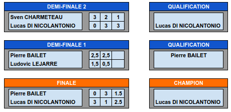

Guingamp_Echecs Stream, c'est l'histoire d'un groupe d'amis fans d'échecs qui ont pour point commun d'être tous passés par l'échiquier Guingampais. Après le succès de la retransmission de notre participation au championnat d'Europe des clubs, nous allons continuer à partager notre passion avec fun et pédagogie. Au programme session live, analyse et commentaires de compétitions !

Venez découvrir notre équipe sur [Twitch](https://www.twitch.tv/guingamp_echecs), [Youtube](https://www.youtube.com/channel/UCDa-Z-OF7U1xfGy3s835AxQ), et [Lichess](https://lichess.org/@/guingamp-echecs).

Nos prochains rendez-vous
======
  * Samedi 12 Juin à 20h00 : [Match en équipe Interligues - 6ème édition](https://lichess.org/tournament/ZziPYv7E)
  * Lundi 14 Juin à 21h00 : On s'entraine ! Problèmes sur lichess avec Pierre et Tangi
  * Mardi 15 Juin à 21h00 : le match du mardi (blitz, bullet et puzzle racer)

 

Guingamp vs Reste du monde : 1-0
======
Tous les mardis retrouvez Guingamp vs Reste du monde, où un joueur guingampais va affronter en match (puzzles, bullet et blitz) un autre joueur d'échecs.

Ce mardi 8 juin, c'est le Mf Ronan Le Goff (Guingamp) qui l'a emporté contre François-Xavier Podvin au terme d'un match épique 19-12 ( 5-0 en puzzle racer, 3-4 en bullet, 4-2 en blitz) et ouvre le score pour Guingamp.

Rendez-vous mardi prochain à 19h.

Challenge Gwengamp Chess
======

Du 8 Mai au 6 Juin, nous organisons un tournoi exceptionnel avec 8 joueurs, revoir [la présentation sur youtube](https://www.youtube.com/watch?v=ARqkzBN-I2k). Victoire du MI Lucas DI NICOLANTONIO au terme d'une finale à rebondissement ! Bravo !

Le tableau de la phase finale :    

News
======

  

