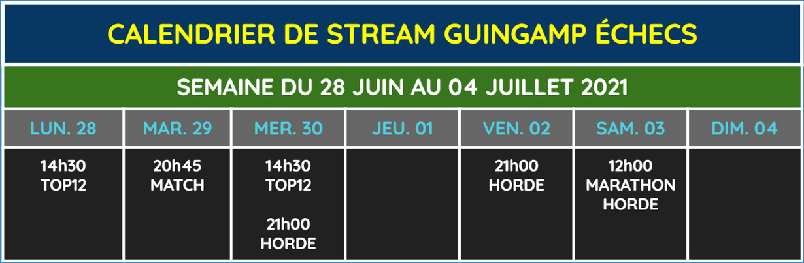
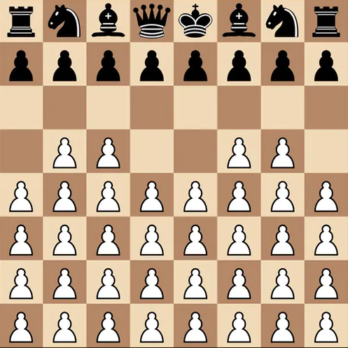

Guingamp_Echecs Stream, c'est l'histoire d'un groupe d'amis fans d'échecs qui ont pour point commun d'être tous passés par l'échiquier Guingampais. Après le succès de la retransmission de notre participation au championnat d'Europe des clubs, nous allons continuer à partager notre passion avec fun et pédagogie. Au programme session live, analyse et commentaires de compétitions !

Venez découvrir notre équipe sur [Twitch](https://www.twitch.tv/guingamp_echecs), [Youtube](https://www.youtube.com/channel/UCDa-Z-OF7U1xfGy3s835AxQ), et [Lichess](https://lichess.org/@/guingamp-echecs).

Nos prochains rendez-vous
======
  * Lundi 28 Juin à 14h30 : Le coach Simon Le Marec à l'analyse tout l'après-midi
  * Lundi 28 Juin à 21h00 : On apprends à jouer à Horde
  * Mardi 29 Juin à 21h00 : Le match du mardi (blitz, bullet et puzzle)
  * Vendredi 2 Juillet à 21h00 : On apprends à jouer à Horde (avec un invité spécial)
  * Samedi 3 Juillet à 12h00 : [Lichess Horde Revolution 2](https://lichess.org/tournament/GoRlDCgt)

 

Horde ! 36 pions vs le reste de l'échiquier
======
"Les pions sont l'âmes des échecs" disait Philidor. Peuvent-ils s'unir et se battre contre tout l'échiquier ? C'est le but de la Horde, les blancs ont 36 pions et doivent lutter contre toutes les pièces noires. Du 28 juin au 4 juillet, on apprend à jouer à Horde et on prépare le [Lichess Horde Revolution 2](https://lichess.org/tournament/GoRlDCgt). Les règles du [Horde sur Lichess](https://lichess.org/variant/horde).

Guingamp vs Reste du monde : 2-0
======
Tous les mardis retrouvez Guingamp vs Reste du monde, où un joueur guingampais va affronter en match (puzzles, bullet et blitz) un autre joueur d'échecs.

Ce mardi 22 juin, c'est Briac Denizet (Guingamp) qui a remporté un match surprise 20-14 (Chess960, bullet et blitz) contre Antoine Marchais (Rennes PB).
Rendez-vous mardi prochain à 21h.

News
======

  

